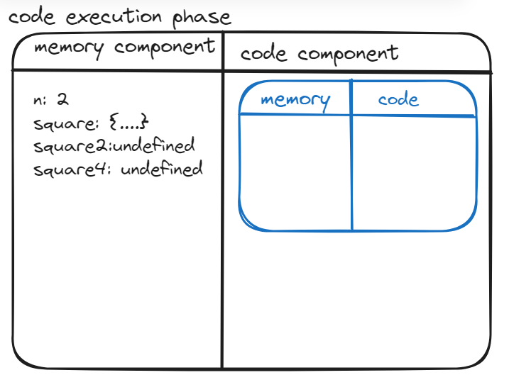
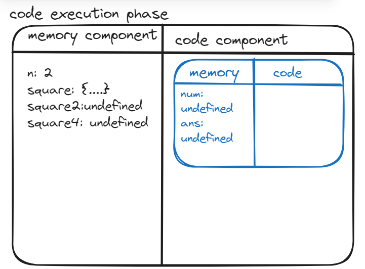
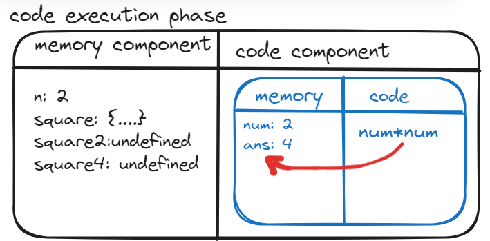
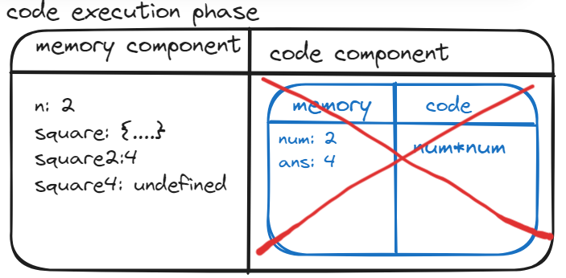
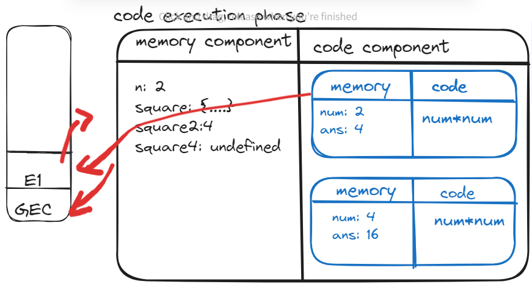

# Async JS

- Js is synchronous by default
- its single threaded (every thing will be executed in one thread)
- then we might think it will be slow language 

 Execution context:  
- everything in JS happens inside Execution context
- we can assume it as a big box or container in which whole JS code is executed  

credits:https://excalidraw.com/

[diagram]
- memory component also known as variable environment is the place where all the variables and functions are stored as key-value pairs.
- code component also know as thread of execution is the place where code is executed one line at a time 
- JS is cynchronous single threaded lanuage that means it can only execute one command at time and in a specific order. that means it can only go to next line if current line is finished executing 
- what happens when you run a JS program? - an execution context is created.
- 
- when we run above code a global execution context is created
- [diagram]
- this execution context is created in two phases 
1. First phase is - creation phase / memory creation phase which is critical phase

    - JS will allocate memory to all the variables and functions
    - as soon as JS encounters line 1, it allocates memory to 'n'.
    - now JS goes to line 2 so it sees that there is also a function which is named as square, so it will allocate memory to square. 
    - so what does memory stores? its stores a special value which is known as undefined as square, square2, square4 are variables.
    - in case of function it stored the whole code of functione from line 2- 5 in memory space.
    - to summarize in first face JS goes through the code line by line and allocate memory to all variables and functions. 
2. 2nd Phase: code execution phase:
    - now JS once again runs through whole JS code, and it executes the code now 
    - till now value of n = undefined now 2 is placed in memory allocated for n
    - line 2-5 there is nothig to execute
    - so it goes to line 6: here ve invoke a function, 
    - whenever a function is invoked, an altogether new execution context is created and again 2 phases involved- for function parameters, variables and functions involved if any.
    - till now the whole program was inside global execution context.  
    
    - Phase 1 for function:
    
    - phase 2 for function:
    
    - return will just return control back to the execution condext where the function was invoked.
    
    - once the function is executed the execution context of that function will be deleted 
    - for line 7 same steps will be performed.
    - after every code execution is finished the complete execution context will be deleted.
    
### Call Stack
- as execution context can go any deeper, it will be difficult for JS engine to manage. 
- To manage, creation,deletion and the control of execution context it manages a stack.
- call stack is a stack: and every time in the bottom of stack we have <b>global execution context</b>
- That means whenever any JS program is run, this call stack is populated with this global execution context.
- whenever a function is invoked a new execution contexis created, so this new execution contex is put inside the stack [E1]

- once function execution is finished, now E1 is poped out of the stack and the control goes back to the global execution context.
- similarly E2 is created for second function invocation
- after whole code is executed the call stack gets empty. 
<b style="color:#D9C5B2"> Call stack mainains the order of execution of execution contexts</b>

- names of call stack- 
    - execution context stack, 
    - program stack, 
    - control stack, 
    - runtime stack, 
    - machine stack

