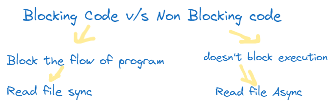
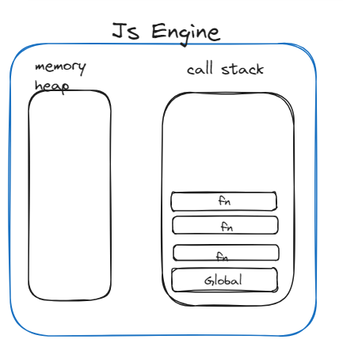
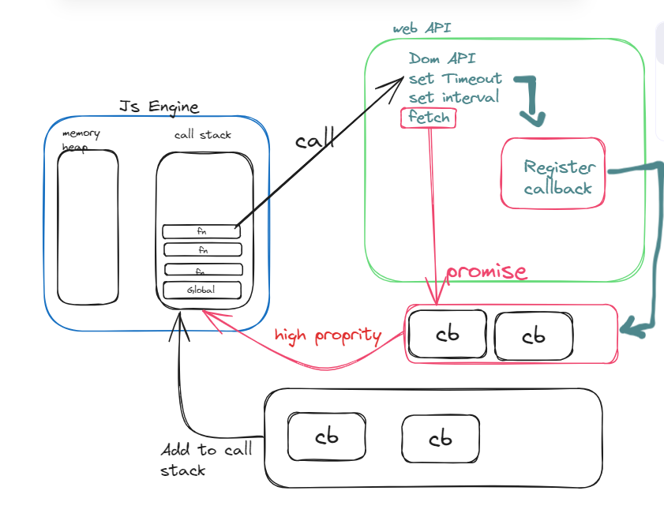
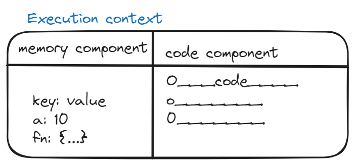
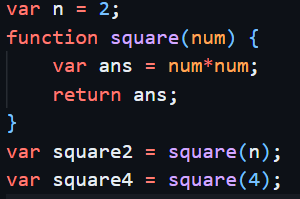
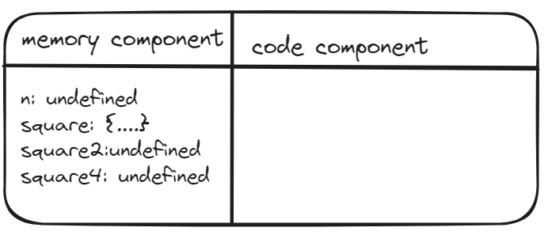
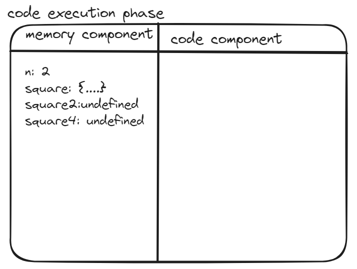

# Async JS

- Js is synchronous by default
- its single threaded (every thing will be executed in one thread)
- then we might think it will be slow language.
- Blocking Code v/s Non-Blocking Code: 

 
- as if we are asking "I will go fetch water till then you can't do anything"
- "I will go fetch water till then you can perform your tasks"
- ex: Read file system - node.js (blocking) 
- read file async - non blocking
- In case we have a screario to read userdata and sussefull message that "registeration is successful", in this case we need synchronous, ortherwise in non-blocking approach till user data is fetched give success message which would be wrong.
- there is seperate use case for both  

 
- ⛳Js engine consists of memory heap and call stack.
- however in execution environment like in browser, node.js, deno there won't be alone JS Engine.
- <b style="color:#B0FF92">⛳ web Api:</b> present in browser (DOM API)
- there will be some environment along with webAPI (i.e node)
- <b style="color:#B0FF92">⛳ Task Queue:</b> 
  
- In case of Promise: there is seperate queue for promise which is called 🚀<b>high priority Queue</b>.
- ex: setTimeOut :
    - which will be available in Web API or node API.
    - There is register callback in that it will get registered that particular task to be performed after 2sec etc.(or event on button click).
    - Task Queue(FIFO): since program exit from JS engine for setTimeOut execution, we need to go back to JS engine to excute, but how? as there are many other tasks lined up. 
    - Register call back sayes whenever there is such event (Async), it adds its callbacks(btn event, set timeout) in queue
    - Then Task Queue handles callbacks lined up, it adds all those into call stack. (adds at the top) then it executed.
    - setTimeOut(0): (0,[0,2],3) console 2 after 0 time, as setTimeout is callback it goes to seperate process till then (in that duration) 3 will be executed.
    - Fetch(promise): it created another task queue with is of high priority which makes it difference.
    -  

 Execution context:  
- everything in JS happens inside Execution context
- we can assume it as a big box or container in which whole JS code is executed  

credits:https://excalidraw.com/  

- memory component also known as variable environment is the place where all the variables and functions are stored as key-value pairs.
- code component also know as thread of execution is the place where code is executed one line at a time 
- <b style="color:#E0EEC6">JS is synchronous single threaded lanuage that means it can only execute one command at time and in a specific order. that means it can only go to next line if current line is finished executing </b>
- what happens when you run a JS program? - an execution context is created .

- when we run above code a global execution context is created
- [diagram]
- this execution context is created in two phases 
1. First phase is - creation phase / memory creation phase which is critical phase

    - JS will allocate memory to all the variables and functions
    - as soon as JS encounters line 1, it allocates memory to 'n'.
    - now JS goes to line 2 so it sees that there is also a function which is named as square, so it will allocate memory to square. 
    - so what does memory stores? its stores a special value which is known as undefined as square, square2, square4 are variables.
    - in case of function it stored the whole code of functione from line 2- 5 in memory space.
    
    - to summarize in first face JS goes through the code line by line and allocate memory to all variables and functions. 
2. 2nd Phase: code execution phase:
    - now JS once again runs through whole JS code, and it executes the code now 
    - till now value of n = undefined now 2 is placed in memory allocated for n
    - line 2-5 there is nothig to execute
    - so it goes to line 6: here ve invoke a function, 
    - whenever a function is invoked, an altogether new execution context is created and again 2 phases involved- for function parameters, variables and functions involved if any.
    - till now the whole program was inside global execution context.  
    
     
    - Phase 1 for function:  
    
    - phase 2 for function: 
    
    - return will just return control back to the execution condext where the function was invoked.
    
    - once the function is executed the execution context of that function will be deleted 
    - for line 7 same steps will be performed.
    - after every code execution is finished the complete execution context will be deleted.
    
### Call Stack
- as execution context can go any deeper, it will be difficult for JS engine to manage. 
- To manage, creation,deletion and the control of execution context it manages a stack.
- call stack is a stack: and every time in the bottom of stack we have <b>global execution context</b>
- That means whenever any JS program is run, this call stack is populated with this global execution context.
- whenever a function is invoked a new execution contexis created, so this new execution contex is put inside the stack [E1]

- once function execution is finished, now E1 is poped out of the stack and the control goes back to the global execution context.
- similarly E2 is created for second function invocation
- after whole code is executed the call stack gets empty. 
<b style="color:#D9C5B2"> Call stack mainains the order of execution of execution contexts</b>

- names of call stack- 
    - execution context stack, 
    - program stack, 
    - control stack, 
    - runtime stack, 
    - machine stack

