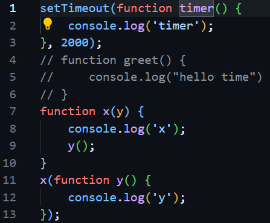
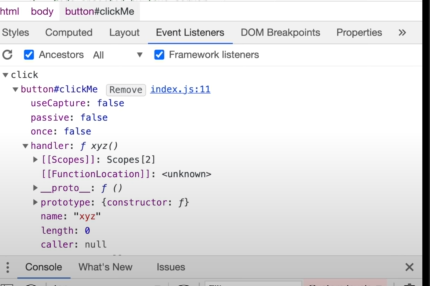
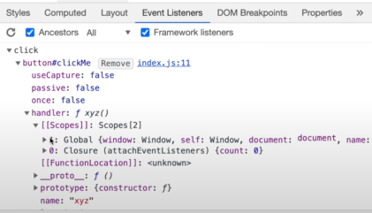
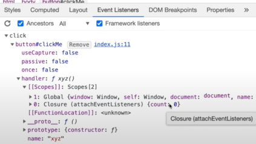

# CallBacks 

### Topics:
- what is callback function in JS
- its uses
- Blocking the main thread.
- power of callbacks
- Event Listeners.
- closures demo with Event Listeners.
- scope demo with Event Listeners.
- garbage collection and remove event listeners.

###  what is callback function in JS
- 'Functions are first class citizens' 
- we can take a function and pass it into another function. the function which we pass into another function(parameter function) is known as call back function.
- These are very powerful in JS- it gives access to the asynchronous world in a synchronous single threaded language.
- but due to call backs we can do async things inside JS.
 ex:
 ```
 function x(y) {
    
}
x(function y()){
    
}
```
function y in above is callback function.
- but why its called as callback function? : we call fun y sometime else in our code and executes and gets out of callstacks, its not called while passing fun as parameter as in Event Listeners.
- we give the responsibility of function 'y' to another function. now its upto 'x' when it wants to call y. (function y is called sometimes back in code).
- Now lets see how its used in Async tasks:
```
// Function to be executed after the delay
function greet() {
    console.log('Hello, world!');
}

// Call greet after 2000 milliseconds (2 seconds)
setTimeout(greet, 2000);
function x(y){
    console.log("x");
    y();
}
x(function y(){
    console.log("y");
})
//output: x y timer
```

- in above example greet is a callback function
- setTime out takes greet function and store it ina seperate space with timer attached to it.
- whatever code is present its executed through call stack only.
- if any operation blocks this callstack that is know as blocking the main thread.
- suppose if a function x has a very heavy operation that takes 20-30 sec during that time as jS has only one call stack/one main thread it won't be able to execute any other function in the code so everything will be blocked on the code 
- we should never block the main thread, we should try to use async operations for things which takes time.
### EventListerner Demo:
```
let count = 0;
document.getEelementByTd('btn').addEventListener('click', function onClick(){
 console.log("Button Clicked", count++);
});
```
### Clouser example:

```
function attachEventListener(){ //closure
let count = 0; //lexical scope
document.getEelementByTd('btn').addEventListener('click', function onClick(){
 console.log("Button Clicked", count++);
});
}
attachEventListener();
```
- callback function inside eventlistener is forming closure with outer function: attachEventListener
- [event listener screenshot : 17:42] <br>


- In above we can see global and closure scope
### Garbage collection and removeEventListeners.
- why do we remove event listeners?
    - they are heavy that means it takes memory
    - whenever we attach a event listener it forms a closure. 
    - eventhough call stack is empty when we are not executing, but still the program is not freeing up that memory<br>
    
    - it cannot free up that closure because we never know when event will be triggered 
    - so we need to remove it there might log of eventlisteners.
    - it its good pratice to remove eventListeners.
    - if I remove attachEventListener all variables held by this closure, will be garbage collected.


