# How Functions Work in JavaScript💥

```
var x = 1;
a();
b();
console.log(x);

function a() {
  var x = 10;
  console.log(x);
}

function b() {
  var x = 100;
  console.log(x);
}
```

```
output:
10
100
1
```

image1: GEC
<br>
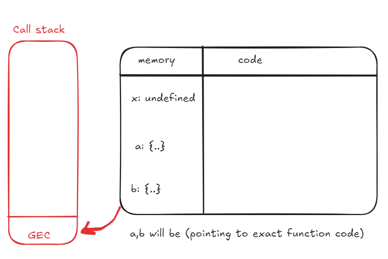
<br>

- **call stack is a stack where all global execution context are kept.**
- when we create create global execution context it will be pushed into the call stack (as in above image).
- now, when we execute code, during the first line.

```
var x = 1
```

<br>
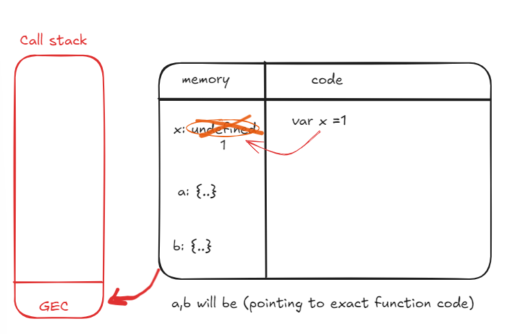
<br>

<br>
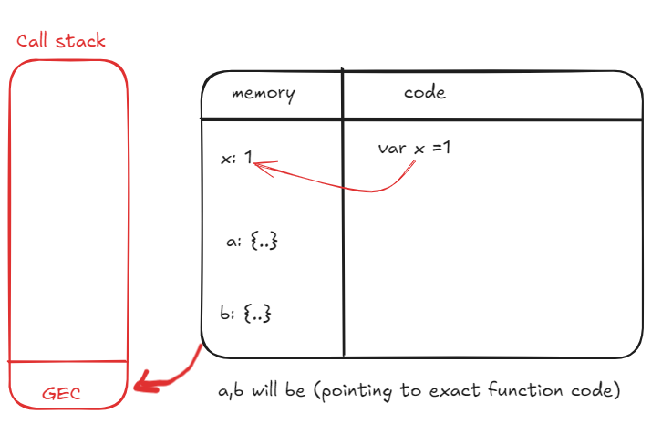
<br>

- now x becomes 2.
- now code moves to 2nd line.

```
a()
```

<br>

<br>

- when a() function is invoked. An execution context is created, and it pushed into the call stack
- Now it will again go into two phases (Memory creation, code execution).
- memory will be allocated to all the variables and functions inside a() function.
- ⭐ we have a variable x in function a() which has same name as x in global scope.
- x in a() will have a seperate memory inside execution context of a() environment.

<br>
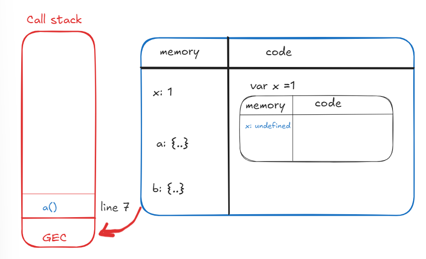
<br>

<br>
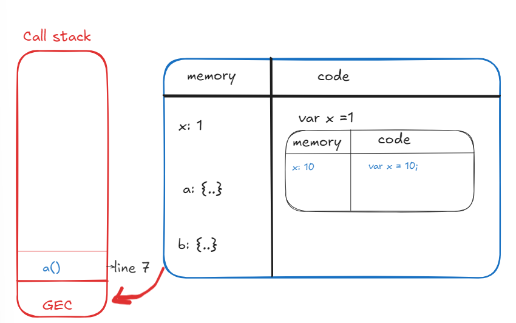
<br>

- Control was at line 2. when function is invoked the control goes to line 7.
- and like 7 will be executed and in memory of x undefined is replaced as 10

<br>
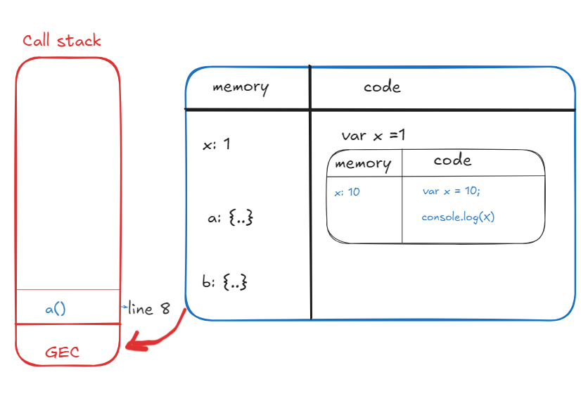
<br>

- now control goes to line 8. (console.log(x))
- JavaScript engine will look for the value of x in local memory space(current execution context).
- it finds value of x as 10 in local memory and it prints on console.

<br>
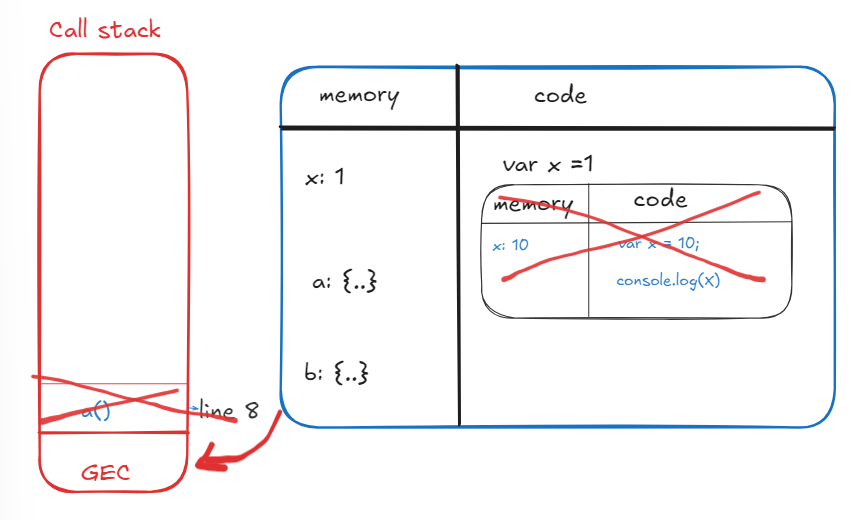
<br>

- now we have finished executing function a(). The whole execution context of function a() will be deleted. also it will be poped out of call stack (as in above image).
- then control goes to line 3.
  overview of function b():
  <br>
  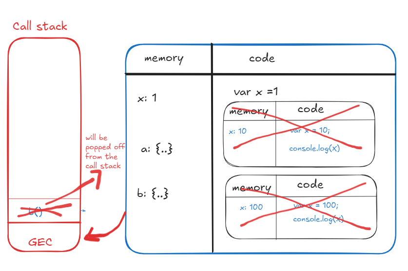
  <br>

- again execution context for function b() will be created and steps will be repeated and execution context for b() will be deleted also from call stack(as in above image).

<br>
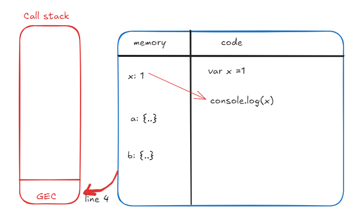
<br>

- then control comes back to Global Execution Context (line 4).
- as there is console.log(x), JS engine will for x in local space/memory of that particular execution context( that is GEC).
- here value of x is 1, so it will be printed in console ( that is 1 will be printed).
- now control moves to next line it see that there is nothing more to execute.

<br>
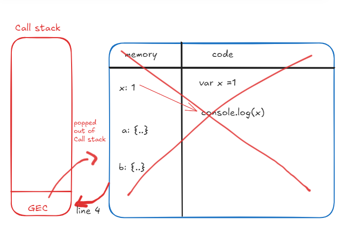
<br>

- once whole code has been executed, the main execution context will also be deleted and also popped out off call stack.

<br>
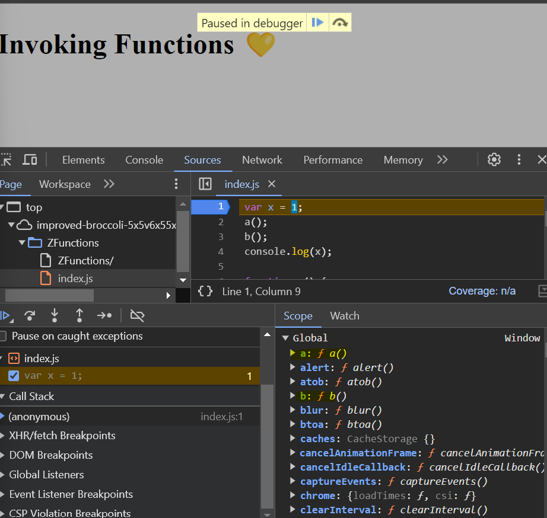
<br>

<br>
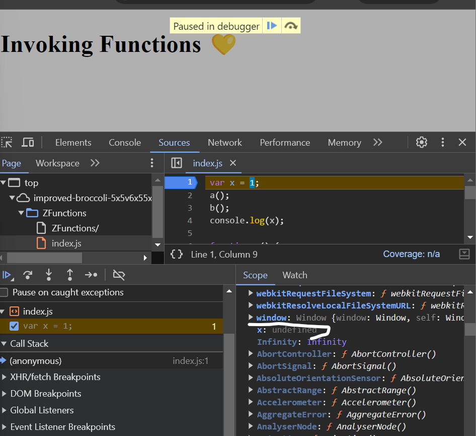
<br>

- in above image we can see function a(), b() in call stack, and x will be undefined.

<br>
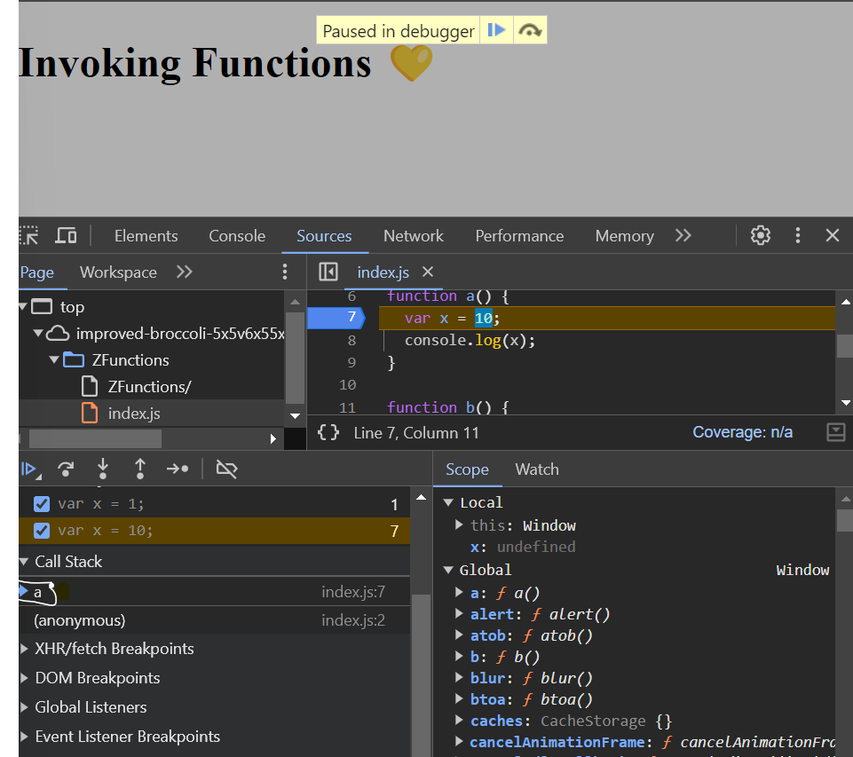
<br>

- in above image we can see that execution context for a() is created. and we can see local and global scope.
- ⭐ note that there is this: window in local scope (will be discussed later).

- we can see above explaination in call stack while debugging.

# Shortest JavaScript Program 💥

- An empty js file is the shortest JS program.
- even though there is no code in js file javascript engine will still do its work.
- and it still creates global execution context also sets up the memory space.
- It also creates **"window"**
- there is "this" object as weel, at the global level it points to the window object.
- what is window?: <br>
  it is a global object which is created along the global execution context<br>
  In JavaScript, the window object represents the global context of a web page in a browser. It's the top-level object that contains everything else, including variables, functions, and the Document Object Model (DOM). The window object gives access to properties, methods, and events that can interact with the browser window itself.<br>
- "this" object at the global level points to the window object.
- Global object incase of browsers is know as window.
- all JS engines has a responsibility to create global object.
- in case of node.js its global

```
this === window
o/p: true
```

consider below example

```
var a =10;
function b(){
  var x = 10;
}
```

- in above example, variable 'a' is in global space, variable x is in local space as its inside function.
- console.log(window.a) is same as console.log(a)
- in console.log(a) its automatically assume that we are refering to global space (Window).

```
var a =10;
function b(){
  var x = 10;
}
console.log(x)
```

- above code produces error: ReferenceError: x is not defined

```
var a =10;
function b(){
  var x = 10;
}
console.log(x);
console.log(window.a);
console.log(a);
console.log(this.a);
```

- window.a, a, this.a are all same in global space

### Conslusion ⭐:

- conclusion of how JS is executed: <br>
  it creates GEC, and allocates memory to all variables and functions, even before a signle line of code is executed
