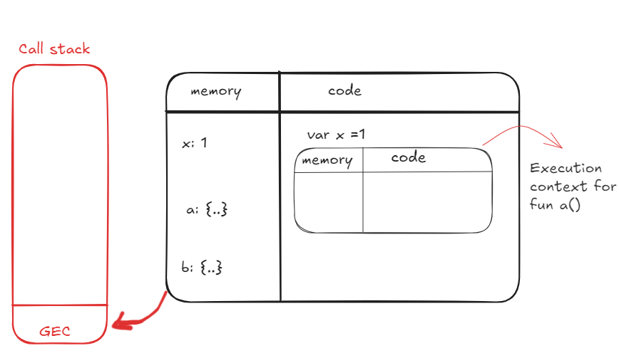

# How Functions Work in JavaScript💥

```
var x = 1;
a();
b();
console.log(x);

function a() {
  var x = 10;
  console.log(x);
}

function b() {
  var x = 100;
  console.log(x);
}
```

```
output:
10
100
1
```

image1: GEC
<br>

<br>

- **call stack is a stack where all global execution context are kept.**
- when we create create global execution context it will be pushed into the call stack (as in above image).
- now, when we execute code, during the first line.

```
var x = 1
```

<br>

<br>

<br>

<br>

- now x becomes 2.
- now code moves to 2nd line.

```
a()
```

<br>

<br>

- when a() function is invoked. An execution context is created, and it pushed into the call stack
- Now it will again go into two phases (Memory creation, code execution).
- memory will be allocated to all the variables and functions inside a() function.
- ⭐ we have a variable x in function a() which has same name as x in global scope.
- x in a() will have a seperate memory inside execution context of a() environment.

<br>

<br>

<br>

<br>

- Control was at line 2. when function is invoked the control goes to line 7.
- and like 7 will be executed and in memory of x undefined is replaced as 10

<br>

<br>

- now control goes to line 8. (console.log(x))
- JavaScript engine will look for the value of x in local memory space(current execution context).
- it finds value of x as 10 in local memory and it prints on console.

<br>

<br>

- now we have finished executing function a(). The whole execution context of function a() will be deleted. also it will be poped out of call stack (as in above image).
- then control goes to line 3.
  overview of function b():
  <br>
  
  <br>

- again execution context for function b() will be created and steps will be repeated and execution context for b() will be deleted also from call stack(as in above image).

<br>

<br>

- then control comes back to Global Execution Context (line 4).
- as there is console.log(x), JS engine will for x in local space/memory of that particular execution context( that is GEC).
- here value of x is 1, so it will be printed in console ( that is 1 will be printed).
- now control moves to next line it see that there is nothing more to execute.

<br>

<br>

- once whole code has been executed, the main execution context will also be deleted and also popped out off call stack.

<br>

<br>

<br>

<br>


- in above image we can see function a(), b() in call stack, and x will be undefined.

<br>

<br>


- in above image we can see that execution context for a() is created. and we can see local and global scope.
- ⭐ note that there is this: window in local scope (will be discussed later).

- we can see above explaination in call stack while debugging.

# Shortest JavaScript Program 💥

- An empty js file is the shortest JS program.
- even though there is no code in js file javascript engine will still do its work.
- and it still creates global execution context also sets up the memory space.
- It also creates **"window"**

