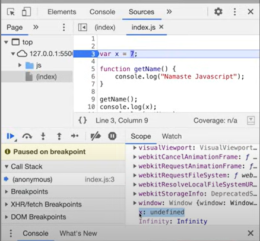
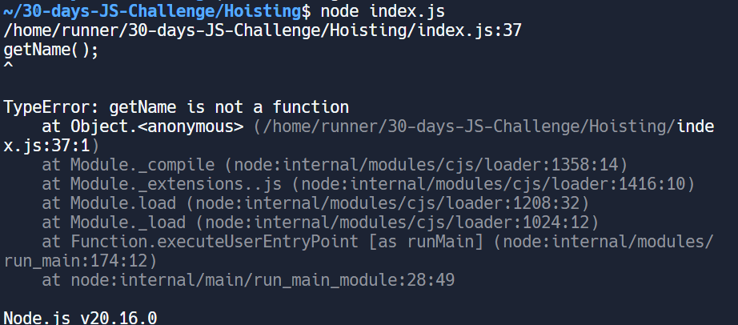
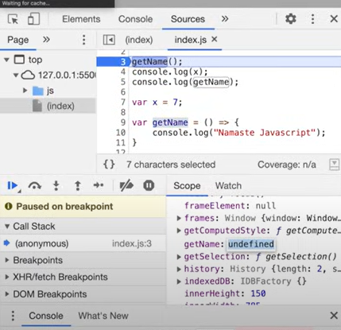
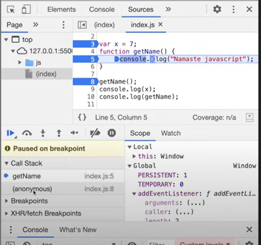

# Hoisting in JS🌼
### Example1:
- Below code is basic js code it executes fine.
```
var x = 7;
function getName() {
  console.log("Hi there!!!");
}
getName();
console.log(x);
```
### Example2:
- here is the change. can you guess what will be the output?
```
getName();
console.log(x); // we are accessing x before initilization

var x = 7;
function getName() {
  console.log("Hi there!!!");
}
```
```
output:
Hi there!!!
undefined
```
### Example3:
- check below code ✨
```
getName();
console.log(x); // we are accessing x before initilization

//var x = 7;
function getName() {
  console.log("Hi there!!!");
}
```
output: it will produce Error "RefrenceError: x is not defined"
- in example2 it was undefined and now its error.
- is it undefined and not defined are not same thing? 
answer is its not the same.
## What is Hoisting?✨:
### ☀️Hoisting in JavaScript is a phenomena, where we can access these variables and functions even before initialization.

### Example4a:
```
var x = 7;
function getName() {
  console.log("Hi there!!!");
}
console.log(getName)// we are not trying to invoke this function
```
-if I run, it again gives us the function
### Example4b:
```
console.log(getName);
var x = 7;
function getName() {
  console.log("Hi there!!!");
}
```
- in case of x it gives undefined
- in case of function of function it gives us the function.
## ⭐Why it happened?
- even before code starts executing, the moemory will be allocated to variables and functions (see execution context).
<br>

<br>
- in above image we see variable 'x' has alread been allocated a memory space even before we have started executing and it stored a special keyword "undefined" for these variables.
- in case of getname we don't get undefined, but actual copy of a function before executing code.

## ⭐Difference between "not defined" and "undefined":
### Example5:
```
getName();
console.log(getName);
console.log(x)
function getName() {
  console.log("Hi there!!!");
}
```
- as we have not reserved the memory for the x. we just have memory reserved for "getName" function.
- in this case when code tries to access 'x' variable while executing, but x is not present and there is no value for x. so JavaScript will throw a 'ReferenceError: x is not defined'
### ✨Example6:
```
//exampe6: getName as the arrow function
getName();
console.log(x);
console.log(getName);

var x = 7;

var getName = () => {
  console.log("Hi there");
};
```

<br>

<br>
- it will give above error 

## ⭐ Why there is Error for an Arrow function: ()=>{}
- In example 6
- 📍Reason1: when a function is defined as an arrow function it behaves just like a variable.
- 📍Reason2: in memory allocation phase of the execution context, it will allocates undefined to get name
### ✨Example 6a:
```
getName();
console.log(x);
console.log(getName);

var x = 7;

var getName = () => {
  console.log("Hi there");
};
```
### ✨Example 6b:
```
console.log(x);
console.log(getName);

var x = 7;

var getName = () => {
  console.log("Hi there");
};
```
```
output:
undefined
undefined
```
<br>

<br>

### ✨Example7: With Function expression

```
getName2();
var getName2 = function(){
  console.log("getName2")
}
```
<br>

<br>

- above example7 also gives same error as in example6
- 📍Reason: as function expressions also seen as variables
- 📍 only in case of proper function it gets the whole function.

## ⭐Example of call stack:
<br>

<br>