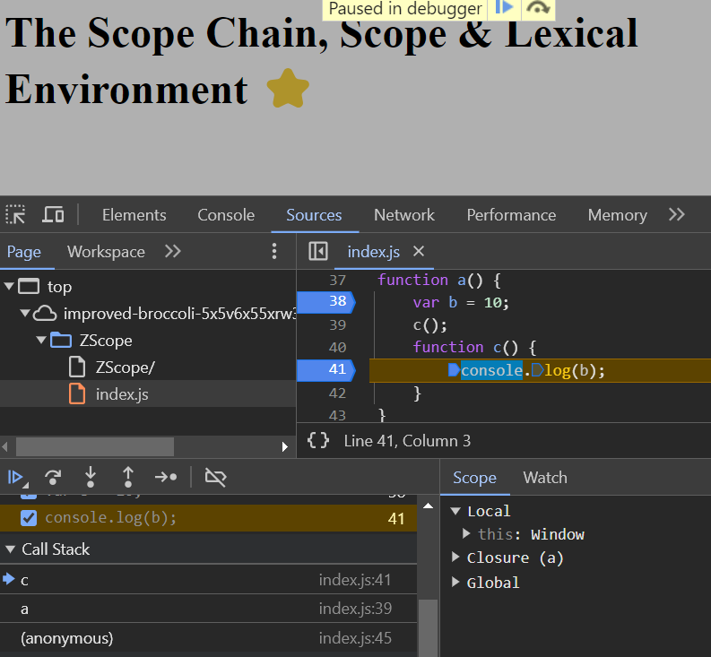

# The Scope Chain, Scope & Lexical Environment ⭐.

- Scope in JS is directly related to lexical environment.
```
function a() {
	console.log(b);
}
var b = 10;
a();
```
- in above code, while executing console.log(b) JS will try to find out, whether b exist in the local memory space (that in function a()'s execution context).
- But variable b is not present in local memory space (that is inside a()).
- what will happen in this case? will it pring undefined or not defined?
- Answer: it prints 10.
```
function a() {
	c();
	function c() {
		console.log(b);
	}
}
var b = 10;
a();
```
```
output:
10
```
```
function a() {
    var b = 10;
	c();
	function c() {
		console.log(b);
	}
}

a();
```
above code will give 10
```
function a() {
    var b = 10;
	c();
	function c() {
		console.log(b);
	}
}

a();
```
```
function a() {
	var b = 10;
	c();
	function c() {
		console.log(b);
	}
}

a();
console.log(b);
```
above code will give error, this is where scope comes into picture.

- Scope means where we can access a specific variable or a function in our code.

### Lexical Environment:
- as we know GEC is pushed on to the call stack, and EC for a,b will be created and pushed on to the stack.
-  ✨whenever an execution context is created, a lexical environment is also created. 
- ✨💥***lexical environment is a local memory along with the lexical environment of its parent***.
- Lexical as a term means "in hirerarchy" or "in a sequence" or "in order".
```
function a() {
	var b = 10;
	c();
	function c() {
		console.log(b);
	}
}

a();
console.log(b);
```
- here in above code, c function is lexically sitting inside a function.
- or we can say that function c() is physically present inside function a().
- and a() is lexically inside the global scope.

- for example whenever the EC for c() is created, we also get refrence to the lexical environment of it parent.
- the highlighted place in above image will be pointing to the lexical environment of it parent 
- c is lexically inside a.
- what is lexical environment of a?
its local memory space + lexical environment of a's parent (here its global space).
- all global level lexical environment points to the null because it has no parent. as in below image.
.
```
function a() {
    var b = 10;
	c();
	function c() {
		console.log(b);
	}
}

a();
```
- in above code JS tries to find variable b inside the local memory of c. as there is no variable b inside local memory of C it goes to the reference ( that is lexical environemnt of its parent which is a()). as c is physically present inside a.
- it finds that b is present in a().
- so it prints value of b in console.
- suppose b was not present in a(), it will again go to lexical environment of a's parent which is global scope. 
- suppose there is no b in global space and we never declared it. then JS will go to lexical environment of global space's parent also.
- there it finds null there it ended there is no more space to go.
- now program stops it says "b is not defined".

- This way of finding is known as **SCOPE CHAIN**. (as in above image).
- scope chain - chain of all lexical environment and the parent references ( which we saw in above example.)
conclusion:
- lexical environment is creates whenever an execution context is created.
- lexical environment is local memory + reference to the lexical environment of its(local's parent) parent.
- The entire chaining of the lexical environment is know as scope chain.

### 💥Demo:



