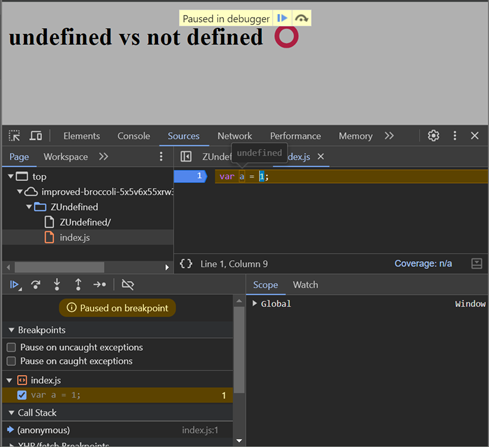

# undefined vs not defined ⭕

- undefined is a special keyword in js.

```
var a = 7;
```



- undefined is like a place holder which is placed inside the memory.
- when JS allocates memory to all variables and functions to the variables it puts a place holder that is 'undefined'.
- in above image a has a value of undefined at that point. where code is not executed.

- Yes, 'undefined' is very different than 'not defined'.

```
var a = 7;
console.log(x);
```

- in above code we haven't declared variable x and so we haven't allocated any memory to variable x.
- if we try to find x we won't find it in globl/window. That is know as not defined.

```
console.log(a);
var a = 7;
console.log(a);
```

```
output:
undefined
7
```

- **undefined is not equal to empty.**
- not defined - variable which has not been allocated memory

Conclusion:

- In JavaScript (and many other languages), a variable is undefined when it has been declared but not initialized (i.e., no value has been assigned to it).
- A variable that has not been declared or defined at all would result in a ReferenceError (not defined).

➖➖➖➖➖➖➖➖➖➖➖➖➖➖➖

```
console.log(a);
var a;
console.log(a);

```
```
output:
undefined
```
example2:
```
console.log(a);
var a;
console.log(a);

if (a === undefined) {
	console.log('a is undefined');
} else {
	console.log('a is not undefined');
}
```
```
output:
undefined
undefined
a is undefined
```
- Javascript is a loosely typed or weakly typed language. which means it does not attaches its variables to any specific data type.
- like for example if I put number(2) in variable later in the program I can also put string ("abc"), or boolean in that same variable
```
var a;
console.log(a);
a = 10;
console.log(a);
a = 'cat';
console.log(a);
```

```
output:
undefined
10
cat
```

- javascript is flexible and beautiful ❤️.
- never do a = undefined (it is possible to assign undefined to a variable as its both keyword and a value).
- undefined states that a variable has not assigned anything. 
- its a bad thing to do !!!. its not a good practice.
- 
